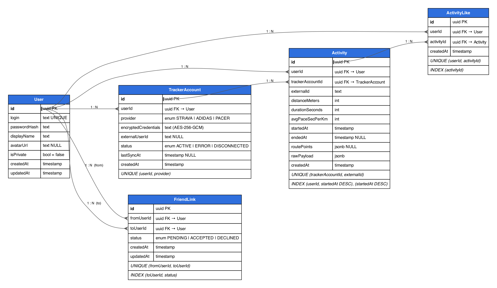

# RunSocial

Мини-социальная сеть для бегунов. Пользователь привязывает аккаунт спортивного трекера
(Strava, Adidas Running, Pacer), система импортирует оттуда пробежки, друзья видят их
в ленте и ставят лайки. У каждой пробежки есть маршрут на карте. Есть публичный лендинг
с общей статистикой.

## Стек

**Бэкенд** — NestJS 11, TypeScript, Prisma + PostgreSQL, Redis (кэш, pub/sub, очередь BullMQ),
S3-совместимое хранилище для аватарок, SuperTokens для аутентификации и ролей.
REST и GraphQL (Apollo, code-first) покрывают один и тот же
набор операций поверх общих use-case'ов; фронтенд ходит в REST за мутациями и в GraphQL за чтением.
SSE для прогресса синхронизации и уведомлений о заявках в друзья.

**Фронтенд** — React 18, Vite, React Router. Без UI-библиотек и без клиента GraphQL:
`fetch` и примерно сорок строк обёрток.

**Инфраструктура** — Docker Compose: postgres, redis, minio, ядро SuperTokens, два процесса
бэкенда (API и воркер из одного образа), nginx со статикой фронтенда, Caddy для HTTPS в проде.

## Запуск

```bash
cp .env.example .env
docker compose up -d --build
```

Фронтенд — http://localhost:8081, GraphQL Playground — http://localhost:3000/graphql.

Миграции применяет контейнер `migrate` до старта API. База поднимается пустой:
первый аккаунт заводится через регистрацию на сайте, пробежки появляются после
привязки настоящего трекера в профиле.

Первому администратору роль выдаётся вручную — регистрируемся на сайте и выполняем:

```bash
docker compose exec postgres psql -U runsocial -d runsocial -c \
  "INSERT INTO supertokens.user_roles (user_id, role) SELECT id, 'admin' FROM \"User\" WHERE login = 'ВАШ_ЛОГИН';"
```

После этого нужно перезайти — роль попадает в сессию при входе. Дальше права
раздаются из админки на http://localhost:8081/admin; ссылки в интерфейсе на неё нет.

Учётные данные трекеров в `.env` не обязательны для старта — без них работает всё,
кроме импорта пробежек. Карта на странице пробежки требует `VITE_YANDEX_MAPS_API_KEY`;
без ключа вместо неё показывается заглушка.

### Разработка без Docker

```bash
docker compose up -d postgres redis minio minio-init   # только инфраструктура
npm install
npm run db:migrate -w backend

npm run dev:api      # API, порт 3000
npm run dev:worker   # воркер синхронизации
npm run dev:web      # фронтенд, порт 5173
```

В `.env` при этом нужны адреса хоста вместо докерных: `postgres` → `localhost`,
`redis` → `localhost`, `S3_ENDPOINT=http://localhost:9000`,
`SUPERTOKENS_CONNECTION_URI=http://localhost:3567`. Порты Redis и SuperTokens придётся
опубликовать — в `docker-compose.yml` они наружу не выставлены.

`VITE_API_URL` при этом остаётся относительным: сессия живёт в cookie, поэтому фронтенд
и API должны быть на одном origin, и запросы из dev-сервера нужно проксировать на API.

## Архитектура

Бэкенд разбит на шесть модулей по областям: `identity` (пользователи, профиль),
`trackers` (интеграции с внешними API), `activities` (пробежки, лента, лайки),
`social` (друзья), `dashboard` (статистика лендинга), `admin` (выдача для админки).
Внутри каждого — четыре слоя:

```
domain/          сущности, доменные ошибки, интерфейсы репозиториев
application/     use-case'ы, DTO
infrastructure/  Prisma-репозитории, HTTP-клиенты трекеров
interface/       контроллеры, резолверы
```

Доменный слой не знает ни про Prisma, ни про HTTP: репозитории подставляются через DI
по символам-токенам.

**Аутентификация и роли — SuperTokens.** Пароли и сессии живут в его ядре, отдельном
сервисе со своей схемой в той же базе; у нас в `User` остаётся только профиль, и его `id`
совпадает с идентификатором аккаунта в ядре. Вход по логину: ядро не требует, чтобы
значение было почтовым адресом, поэтому логин кладётся в поле `email` как есть.
Сессия ходит в cookie — так её получает и `EventSource`, который не умеет слать заголовки.
Ролей две, `USER` и `ADMIN`; роль попадает в payload access-токена, а эндпоинты админки
закрыты декоратором `@VerifySession({ roles: ['admin'] })`.

**Администрирование.** Отдельного пространства путей у админки нет: она ходит в те же
ресурсы, что и обычный пользователь, а право действовать за другого проверяется в use-case'ах
(`PATCH /users/:id`, `DELETE /activities/:id`, `POST /trackers/:id/syncs`). Модуль `admin`
отвечает только за выдачу — список пользователей со счётчиками одним запросом.

**Два процесса из одного образа.** `backend-api` обслуживает HTTP и ставит задачи
синхронизации в очередь, `backend-worker` их выполняет — разбор ответов трекера
не блокирует обслуживание запросов. Прогресс воркер публикует в Redis, API
ретранслирует его в SSE-поток браузера.

**Трекеры** подключены по паттерну Strategy: общий интерфейс `TrackerProvider`,
три реализации и реестр, выбирающий нужную. Новый сервис — это новый класс и строка
в реестре, доменный и прикладной слои не меняются. Учётные данные хранятся
зашифрованными (AES-256-GCM) и расшифровываются только на время похода в API.

**Данные** — пять таблиц: `User`, `TrackerAccount`, `Activity`, `FriendLink`, `ActivityLike`.
Маршрут лежит JSONB-полем в `Activity` и не читается в списковых запросах, иначе лента
весила бы мегабайты.

**Файлы.** Аватарка загружается multipart-запросом на бэкенд, тот проверяет тип по сигнатуре
файла и кладёт объект в S3-совместимое хранилище. Отдаёт её тоже бэкенд по адресу, совпадающему
с ключом объекта: на каждую загрузку ключ новый, поэтому ответ кэшируется браузером навсегда
(`Cache-Control: immutable`, `ETag`). Браузер и nginx про хранилище не знают, бакет приватный,
а MinIO, Yandex Object Storage или AWS S3 подставляются одним `S3_ENDPOINT` и ключами.

**Кэш** — Redis с инвалидацией по доменным событиям, а не только по TTL: импорт пробежек
и смена профиля сбрасывают нужные ключи. Статистика лендинга живёт 60 секунд,
публичный профиль — 30.

**Два интерфейса поверх одних use-case'ов.** Контроллеры и резолверы не содержат логики:
одна и та же операция, например заявка в друзья, доступна и как `POST /friends/requests`,
и как мутация `sendFriendRequest`. Списки в REST отдаются страницами по `limit/offset`
со ссылками `prev/next` в заголовке `Link`; в GraphQL сложность запроса считается до выполнения
и ограничена сверху, чтобы один запрос не мог поднять всю базу. Документация REST — Swagger
на `/docs`, схема GraphQL — в песочнице на `/graphql`.

## Доменная модель



Источник диаграммы — `backend/prisma/er-diagram.dot`, рендер: `dot -Tpng backend/prisma/er-diagram.dot -o er-diagram.png`.

Предметная область — пробежки и их обсуждение в кругу друзей. Пользователь сам ничего не вводит:
данные о пробежках приходят из внешних трекеров, приложение их хранит, показывает и даёт лайкать.

| Сущность | Что означает | Связи |
|---|---|---|
| `User` | Аккаунт в RunSocial: логин, хэш пароля, имя, аватарка, флаг закрытого профиля | Владеет трекерами, пробежками, лайками; участвует в дружбе с двух сторон |
| `TrackerAccount` | Привязка внешнего трекера (Strava, Adidas Running, Pacer) с зашифрованными учётными данными и статусом последней синхронизации | N : 1 к `User`; один трекер каждого типа на пользователя |
| `Activity` | Пробежка: дистанция, время, темп, маршрут в JSONB и сырой ответ трекера | N : 1 к `User` и к `TrackerAccount`; пара (трекер, внешний id) уникальна, поэтому повторный импорт не плодит дубли |
| `FriendLink` | Заявка в друзья и сама дружба в одной записи: `PENDING` → `ACCEPTED` или `DECLINED` | Две связи N : 1 к `User`: кто отправил и кому |
| `ActivityLike` | Лайк пробежки | N : 1 к `User` и к `Activity`; один лайк на пару пользователь–пробежка |

Все внешние ключи с `ON DELETE CASCADE`: удаление пользователя убирает его трекеры, пробежки,
лайки и дружбы, удаление трекера — импортированные из него пробежки.

## Конфигурация

Один `.env` в корне на все процессы и на docker compose. Значимые переменные:

| Переменная | Назначение |
|---|---|
| `POSTGRES_*`, `DATABASE_URL` | база |
| `REDIS_*` | кэш и pub/sub в БД 0, очередь в БД 1 |
| `S3_*` | хранилище аватарок: встроенный MinIO или внешний провайдер |
| `SUPERTOKENS_CONNECTION_URI`, `SUPERTOKENS_API_KEY` | адрес ядра SuperTokens и ключ доступа к нему |
| `PUBLIC_ORIGIN` | origin, на котором открывают приложение: к нему привязаны cookie сессии |
| `TRACKER_CREDENTIALS_SECRET` | ключ шифрования кредов трекеров, ровно 32 байта в hex |
| `TRACKER_INITIAL_SYNC_MONTHS` | глубина истории при первой синхронизации |
| `TRACKER_MIN_DISTANCE_METERS` | пробежки короче не импортируются вовсе; `0` отключает порог |
| `COMPOSE_PROFILES` | `embedded-s3` поднимает свой MinIO, `https` — Caddy |
| `VITE_*` | вшиваются в бандл при сборке: после правки нужен `docker compose build frontend` |
| `BACKEND_IMAGE`, `FRONTEND_IMAGE` | образы из GHCR; без них compose соберёт их локально |

## Деплой

Первый раз — вручную на сервере:

```bash
git clone <репозиторий> && cd RunSocial
cp .env.prod.example .env    # заполнить всё, помеченное «заполнить»
docker compose up -d --build
```

Дальше разворачивает GitHub Actions (`.github/workflows/ci.yml`). Pull request в `main`
собирает оба образа, слияние — публикует их в GHCR и разворачивает на сервере: тот
забирает готовые образы и ничего не пересобирает у себя.

Секреты репозитория: `SSH_HOST`, `SSH_USER`, `SSH_KEY`, `DEPLOY_PATH` (путь к клону
на сервере) и `VITE_YANDEX_MAPS_API_KEY` — ключ карт вшивается в бандл при сборке,
поэтому нужен уже в CI. Если пакеты в GHCR приватные, на сервере нужен
`docker login ghcr.io`.

### Переход на SuperTokens на работающем сервере

Миграция удаляет колонку `passwordHash`, поэтому на сервере, где уже есть живые
аккаунты, пароли переносят в SuperTokens **до того, как туда приедет новая версия**:

```bash
# 1. дописать в .env: SUPERTOKENS_CONNECTION_URI, SUPERTOKENS_API_KEY, PUBLIC_ORIGIN

# 2. схема под ядро и запуск только его: миграцию сейчас применять нельзя
docker compose exec -T postgres psql -U runsocial -d runsocial \
  -c 'CREATE SCHEMA IF NOT EXISTS supertokens;'
docker compose up -d --no-deps supertokens

# 3. перенос паролей, пока колонка ещё на месте
docker compose run --rm --no-deps \
  -v "$PWD/backend/scripts/import-passwords.js:/app/import-passwords.js" \
  backend-api node /app/import-passwords.js
```

Дальше идёт обычный деплой: миграция удаляет колонку, сервисы поднимаются.

Скрипт отдаёт bcrypt-хэши ядру как есть и привязывает наш `User.id` к созданному
аккаунту внешним идентификатором — пробежки, лайки, трекеры и дружбы остаются на месте,
пользователи входят прежними паролями. Это обычный JS, который монтируется в уже собранный
образ, поэтому пересобирать на сервере ничего не нужно. Повторный запуск безопасен, а после
удаления колонки скрипт откажется работать. Когда перенос сделан, `backend/scripts/`
можно удалить.

Наружу смотрит только Caddy на портах 80 и 443: он получает и продлевает сертификат
Let's Encrypt сам, нужен лишь домен с A-записью на этот сервер. Дальше трафик идёт
в nginx фронтенда, который раздаёт статику и проксирует `/api` в бэкенд. Один домен
на всё, поэтому CORS не нужен.

## Структура

```
backend/
  prisma/        схема и миграции
  src/           модули по слоям, shared/ — guards, кэш, шифрование, S3, Redis
frontend/
  src/app        роутер, шапка, контекст авторизации
  src/pages      экраны
  src/entities   запросы к API по доменным сущностям
  src/shared     клиент REST/GraphQL, SSE, UI-примитивы, стили
caddy/           конфиг обратного прокси для прода
.github/         workflow сборки и деплоя
```

## Известные ограничения

- Провайдеры проверены на реальных API, но на аккаунтах с единицами пробежек:
  поведение на длинной истории и при rate-limit не проверялось.
- Снятие и выдача роли закрывают все сессии пользователя: роль лежит в payload
  access-токена, и иначе права менялись бы только после следующего входа.
- Блокировка кнопки синхронизации живёт в браузере, поэтому перезагрузка страницы
  во время синка её снимет. Дубль задачи при этом не создаётся — она ставится
  с фиксированным `jobId`.
